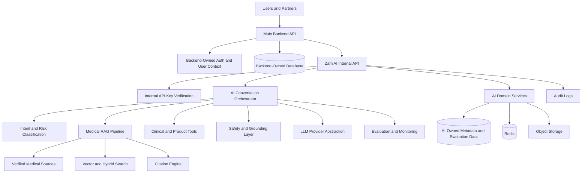

# Zam AI Core API

Zam AI is the medical intelligence platform for Zamda Health. It is designed to
serve patients, doctors, pharmacies, and third-party health companies through a
safe, retrieval-grounded AI system.

This repository is currently in the architecture and documentation phase. The
goal of this phase is to define the complete system before implementation begins,
so engineers joining the project can understand what must be built, why it must
be built that way, and how each subsystem protects medical safety.

## Project Vision

Zam AI exists to make trustworthy medical intelligence accessible across the
healthcare ecosystem.

The platform will support:

- Patient-facing medical guidance
- Symptom checking and triage support
- Drug information and medication education
- Drug interaction and contraindication checks
- Prescription OCR and explanation
- Dosage verification
- Medication reminders
- Personalized health recommendations
- Pharmacy intelligence
- Doctor and clinical decision support
- Predictive healthcare analytics
- Public APIs for health companies

The long-term vision is not to build a generic chatbot. The long-term vision is
to build a safe medical intelligence layer that can reason over verified medical
sources, patient context, medication records, pharmacy data, and clinical
workflows while remaining auditable, explainable, and conservative.

## Core Safety Rule

No medical response should ever come from an LLM's internal knowledge.

Every medical answer must be grounded in verified sources through
Retrieval-Augmented Generation, approved deterministic tools, or structured
clinical data. If the system cannot retrieve reliable evidence, it must refuse,
ask for clarification, or escalate appropriately.

This rule is the foundation of the architecture.

It affects:

- Product requirements
- Retrieval design
- Prompt construction
- Model orchestration
- Database design
- API contracts
- Evaluation
- Monitoring
- Audit logging
- Security and compliance
- Deployment readiness

## Architecture Overview

Zam AI should begin as a modular monolith using FastAPI and Python. The system
should be organized into clear internal domains so that it can later evolve into
separate services where needed.

The initial architecture should include:

- A FastAPI backend
- A backend-owned application database
- Backend-owned user authentication and authorization
- Internal API-key authentication between the backend and AI API
- Redis for caching, rate limiting, and job coordination
- A medical document ingestion pipeline
- A versioned medical knowledge store
- A retrieval and citation engine
- A model-provider abstraction for Claude, Gemini, and future models
- A conversation orchestrator
- Safety, grounding, and confidence checks
- Prescription OCR workflows
- Background workers
- Structured audit logging
- Evaluation pipelines
- Google Cloud Run deployment
- Docker-based packaging
- Production observability

At a high level:



## Expected Technology Stack

### Backend

- Python
- FastAPI
- Pydantic
- SQLAlchemy or SQLModel
- Alembic for migrations

### Database and Storage

- Backend-owned primary application database
- Backend-owned user identity, roles, permissions, and session state
- Internal data access contracts between the backend API and AI API
- AI-owned metadata for prompts, retrieval traces, evaluations, and audit events
- Object storage for files, source documents, prescription images, and artifacts
- A vector search layer selected in the RAG architecture document

### Infrastructure

- Docker
- Google Cloud Run
- Redis
- Cloud-managed secrets
- CI/CD pipeline
- Staging and production environments

### AI

- LLM provider abstraction
- Claude and Gemini as initial target providers
- Retrieval-Augmented Generation
- Medical source grounding
- Citation generation
- Prompt versioning
- Tool calling
- AI evaluation harness

### Observability

- Structured logs
- Request tracing
- Metrics
- Error tracking
- Safety event monitoring
- Cost and latency dashboards

## Repository Structure

The repository is expected to evolve toward the following structure:

```text
zam-ai-core-api/
  README.md
  docs/
    00_PROJECT_HANDOFF.md
    01_PRODUCT_REQUIREMENTS.md
    02_SYSTEM_ARCHITECTURE.md
    03_AI_ARCHITECTURE.md
    04_RAG_ARCHITECTURE.md
    05_DATABASE_DESIGN.md
    06_API_SPECIFICATION.md
    07_SECURITY_AND_COMPLIANCE.md
    08_AI_EVALUATION.md
    09_DEPLOYMENT_ARCHITECTURE.md
    10_ENGINEERING_GUIDELINES.md
    11_ROADMAP.md
    12_DECISION_LOG.md
  app/
    api/
    core/
    domains/
    ai/
    rag/
    workers/
    integrations/
    db/
    telemetry/
  tests/
    unit/
    integration/
    evaluation/
  scripts/
  migrations/
  docker/
```

The implementation directories are intentionally listed as target structure.
They should be created after the architecture documents define the boundaries,
contracts, and development standards.

## Documentation Map

The documentation set is the first deliverable of the project.

| File | Purpose |
| --- | --- |
| `docs/00_PROJECT_HANDOFF.md` | Living project status, decisions, risks, blockers, and implementation notes. |
| `docs/01_PRODUCT_REQUIREMENTS.md` | Complete product requirements document. |
| `docs/02_SYSTEM_ARCHITECTURE.md` | Backend architecture, service boundaries, infrastructure, and observability. |
| `docs/03_AI_ARCHITECTURE.md` | AI orchestration, prompts, tools, memory, safety, and model provider design. |
| `docs/04_RAG_ARCHITECTURE.md` | Medical retrieval, ingestion, chunking, embeddings, citation, and grounding architecture. |
| `docs/05_DATABASE_DESIGN.md` | Database schema, relationships, access patterns, and audit model. |
| `docs/06_API_SPECIFICATION.md` | Internal AI APIs, backend integration contracts, streaming, errors, and admin APIs. |
| `docs/07_SECURITY_AND_COMPLIANCE.md` | NDPA alignment, encryption, internal API keys, consent, threat model, and prompt injection defense. |
| `docs/08_AI_EVALUATION.md` | Groundedness, citation accuracy, clinical correctness, safety, and regression testing. |
| `docs/09_DEPLOYMENT_ARCHITECTURE.md` | Google Cloud Run, Docker, Redis, scaling, logging, and disaster recovery. |
| `docs/10_ENGINEERING_GUIDELINES.md` | Coding standards, testing, documentation, Git workflow, and review practices. |
| `docs/11_ROADMAP.md` | Engineering dependency roadmap from setup through public SaaS platform. |
| `docs/12_DECISION_LOG.md` | Architecture decision records with alternatives, tradeoffs, and future implications. |

## Development Philosophy

Zam AI should be built with the mindset of a regulated, safety-critical medical
AI product.

The platform should optimize for:

- Patient safety
- Source-grounded medical responses
- Auditability
- Explainability
- Privacy
- Conservative failure behavior
- Modular engineering
- Clear contracts between subsystems
- Strong automated testing
- Continuous AI evaluation
- Operational reliability

The platform should avoid:

- Shipping chat before retrieval is reliable
- Letting prompts become undocumented business logic
- Treating medical knowledge as static
- Mixing patient records with canonical medical references
- Building workflows that cannot be audited
- Returning medical answers without citations
- Hiding uncertainty from users
- Scaling usage before evaluation and monitoring are mature

## Initial Build Order

The safest engineering sequence is:

1. Define product, safety, architecture, and data requirements.
2. Build medical source ingestion and versioning.
3. Build retrieval, citations, and grounding verification.
4. Build evaluation datasets and regression testing.
5. Build the AI conversation orchestrator.
6. Build patient-facing medical Q&A and triage support.
7. Build prescription OCR and medication intelligence.
8. Build personalization, reminders, and longitudinal context.
9. Build doctor and pharmacy workflows.
10. Build partner APIs, billing, usage tracking, and developer tooling.

## Current Status

Current phase: architecture documentation.

Current source of truth: `docs/00_PROJECT_HANDOFF.md`.

Implementation should not begin until the core architecture documents define the
medical safety model, RAG pipeline, database schema, API contracts, deployment
architecture, and evaluation framework.
