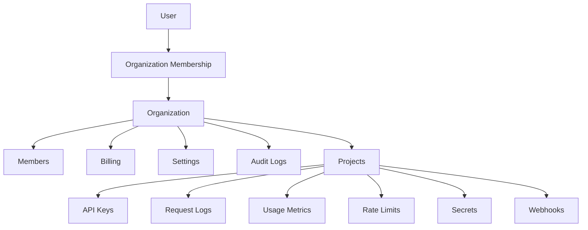
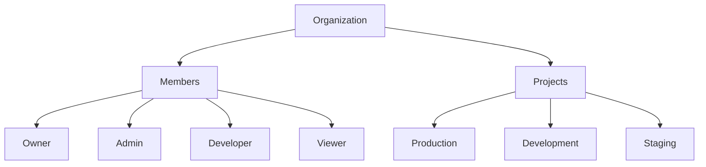
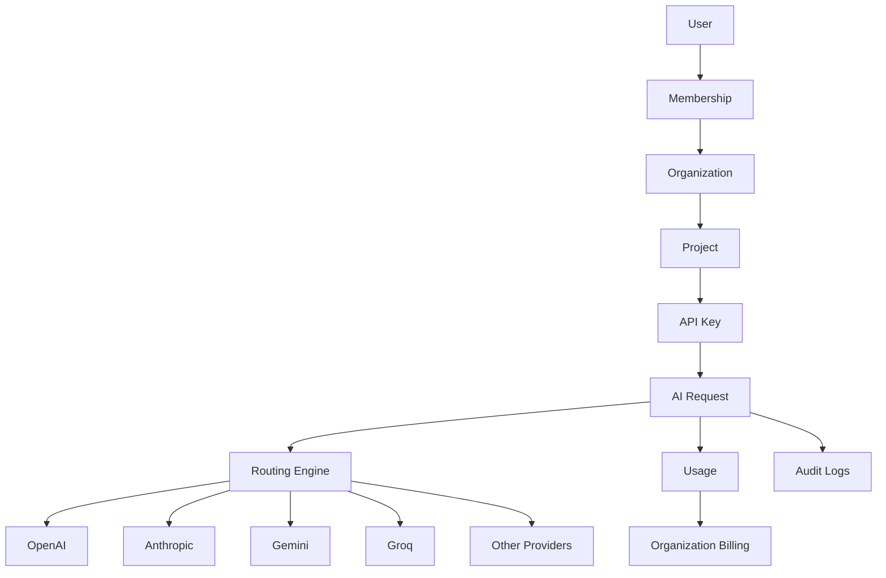

# Tenancy & Ownership Architecture

## Overview

The platform is built around a multi-tenant architecture.

The Organization is the primary ownership boundary.

Every resource in the system belongs to an Organization, either directly or through a Project.

```
User
└── Membership
    └── Organization
        ├── Members
        ├── Projects
        ├── Billing
        └── Settings
```

---

# Core Hierarchy



---

# Organization Structure



---

# Complete Ownership Model



---

# Resource Ownership Rules

| Resource | Owner |
|----------|-------|
| User | Platform |
| Membership | Organization |
| Organization | User(s) |
| Project | Organization |
| API Key | Project |
| Usage | Project |
| Logs | Project |
| Billing | Organization |

---

# Design Principles

- Every user automatically receives one Personal Organization.
- Organizations own Projects.
- Projects own API Keys.
- API Keys generate Usage.
- Billing belongs to Organizations.
- Users never directly own API Keys.
- Permissions are granted through Memberships.