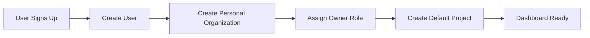
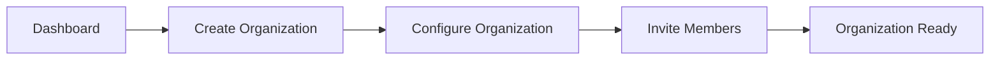
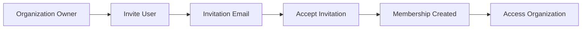
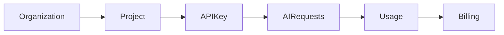
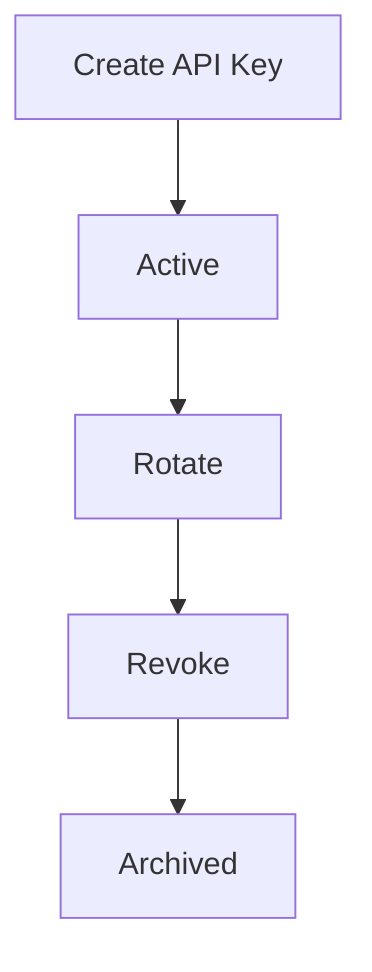
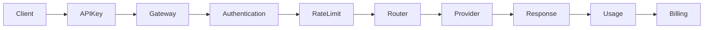
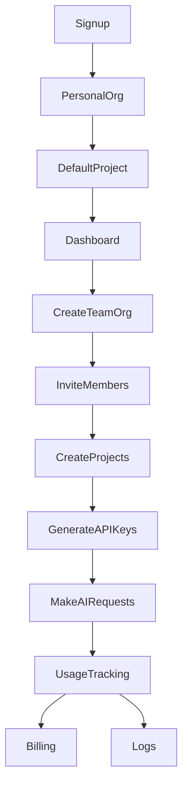

# User Flows

This document describes the lifecycle of users, organizations, projects, memberships, and API keys.

---

# Signup Flow

When a new user signs up:



Result:

```
User
└── Personal Organization
      └── Default Project
```

---

# Personal Organization

Every account receives:

- Personal Organization
- Owner role
- Default Project

The Personal Organization behaves exactly like a Team Organization.

The only difference is that it starts with one member.

---

# Creating a Team Organization



---

# Member Invitation Flow



---

# Project Lifecycle



---

# API Key Lifecycle



---

# AI Request Flow



---

# Complete Platform Flow



---

# Permission Model

```text
Owner
├── Full Access

Admin
├── Manage Members
├── Manage Projects
├── Manage API Keys

Developer
├── Create API Keys
├── View Logs
├── Make Requests

Viewer
├── View Usage
├── View Logs
```

---

# Summary

Platform
└── Users
    └── Memberships
        └── Organizations
            ├── Members
            ├── Projects
            │   ├── API Keys
            │   ├── Usage
            │   ├── Logs
            │   ├── Limits
            │   └── Secrets
            ├── Billing
            └── Settings