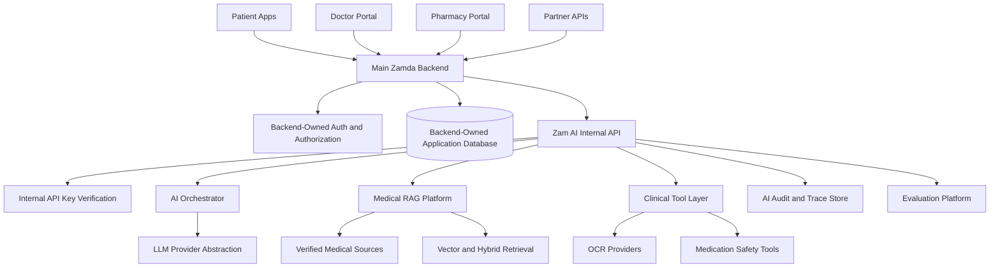
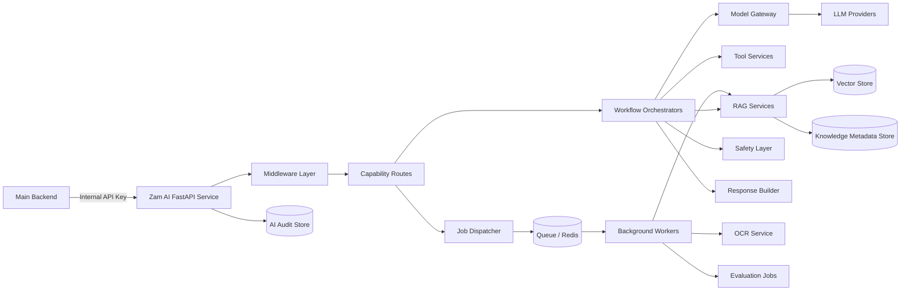
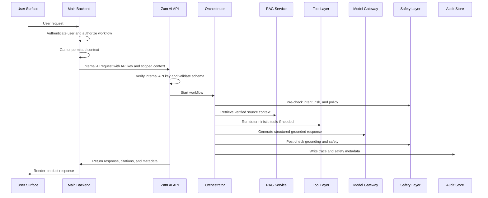
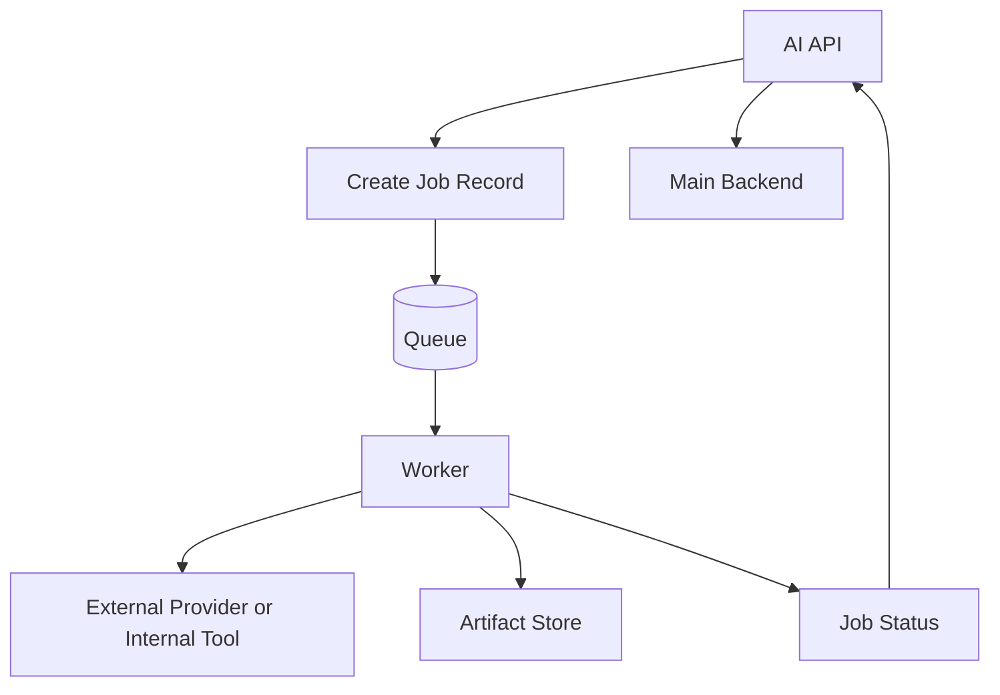
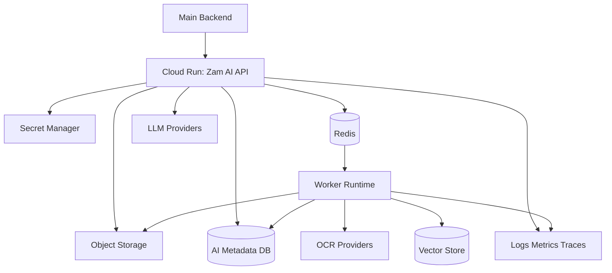

# Zam AI System Architecture

## 1. Purpose

This document defines the backend system architecture for Zam AI.

Zam AI is not the main Zamda Health application backend. It is an internal
medical AI capability service called by the main backend. The main backend owns
end-user authentication, authorization, application database access, sessions,
product-facing APIs, and user-facing orchestration. Zam AI owns AI workflows:
retrieval, grounding, tool routing, model orchestration, safety checks,
citations, audit traces, and evaluation.

This separation matters because medical AI systems must have clear trust
boundaries. The AI service should not silently gain broad access to patient data
or application tables. It should receive only the authorized context required for
the requested workflow.

## 2. Architectural Goals

The system architecture should optimize for:

- Medical safety.
- Clear service boundaries.
- Source-grounded AI behavior.
- Auditability.
- Operational reliability.
- Future scalability to millions of users.
- Provider flexibility for LLMs, OCR, embeddings, and vector search.
- Conservative failure behavior.
- Strong evaluation and regression testing.
- Maintainable implementation for a small early engineering team.

## 3. Non-Goals

The Zam AI service should not:

- Own end-user authentication.
- Own the primary application database.
- Replace the main backend's authorization checks.
- Expose public patient, doctor, pharmacy, or partner APIs directly in the MVP.
- Return medical responses without retrieval, approved tools, or authorized
  structured context.
- Depend on a single LLM provider.
- Treat logs as a substitute for structured audit records.

## 4. System Context



The main backend is the only service that should decide whether a user is
allowed to request a particular workflow. Zam AI should verify that the caller is
an authorized backend service, validate the supplied context, and perform the AI
task safely.

## 5. Service Boundary

### 5.1 Main Backend Responsibilities

The main backend owns:

- User authentication.
- User authorization.
- Patient, doctor, pharmacy, and partner identity.
- Organization and tenant membership.
- User consent.
- Application database design.
- Product-facing REST or GraphQL APIs.
- Billing, subscription, and partner access control unless delegated later.
- Calling Zam AI with an internal API key.
- Supplying only authorized context to Zam AI.
- Storing final user-facing records where the product requires them.

### 5.2 Zam AI Responsibilities

Zam AI owns:

- Internal AI capability endpoints.
- Internal API-key authentication.
- Request schema validation.
- Intent and risk classification.
- Medical RAG.
- Clinical source citation.
- Prompt construction and prompt versioning.
- LLM provider abstraction.
- Tool calling and tool result validation.
- Medical safety policy enforcement.
- Grounding verification.
- Refusal and escalation behavior.
- Structured AI response generation.
- AI-specific audit traces.
- Evaluation datasets and scoring.
- Medical source ingestion if assigned to the AI platform.

### 5.3 Data Boundary

The AI service should treat all patient, doctor, pharmacy, and partner context as
externally supplied, scoped, and temporary unless a specific AI-owned retention
rule exists.

Examples of context the backend may pass:

- User role.
- Organization ID.
- Patient age or age band.
- Allergies.
- Current medications.
- Pregnancy or breastfeeding status.
- Relevant diagnosis or condition labels.
- Prescription details.
- Pharmacy inventory subset.
- Conversation history window.
- Consent flags.

The AI service should never assume it can fetch missing user context directly
from the application database unless a future architecture decision explicitly
defines such an integration.

## 6. Modular Monolith vs Microservices

### 6.1 Options Considered

Option 1: Single modular FastAPI service.

Benefits:

- Faster development.
- Easier local debugging.
- Simpler deployment.
- Easier end-to-end tracing.
- Lower operational burden.
- Better for an early team.

Tradeoffs:

- Requires strong module discipline.
- Some workloads may later need independent scaling.
- Large codebases can become tangled without strict boundaries.

Option 2: Full microservice architecture.

Benefits:

- Independent scaling per service.
- Independent deployment cycles.
- Strong runtime separation.
- Clear ownership at large team size.

Tradeoffs:

- More operational complexity.
- Harder distributed tracing.
- More network failure modes.
- More difficult schema and contract management.
- Premature complexity for a pre-implementation product.

Option 3: Hybrid architecture with one API service and separate workers.

Benefits:

- Keeps online serving simple.
- Allows async workflows for ingestion, OCR, and evaluation.
- Avoids premature service fragmentation.
- Supports future extraction.

Tradeoffs:

- Requires clear shared library boundaries.
- Worker jobs must be idempotent and observable.

### 6.2 Chosen Approach

Zam AI should start as a modular monolith plus background workers.

The initial runtime should contain:

- One FastAPI internal API service.
- One or more worker processes for ingestion, OCR, evaluation, and long-running
  jobs.
- Shared domain libraries with strict module boundaries.
- Shared observability and audit infrastructure.

This is the most appropriate starting point because the product needs safety,
traceability, and rapid iteration more than independent service deployment.
Modules can later be extracted into services after contracts stabilize.

## 7. Runtime Architecture



## 8. Internal Components

### 8.1 API Layer

The API layer exposes internal endpoints used by the main backend.

Responsibilities:

- Verify internal API key.
- Validate request schemas.
- Enforce request size limits.
- Assign or validate request IDs.
- Attach trace context.
- Route requests to workflow orchestrators.
- Stream responses where appropriate.
- Return structured errors.

The API layer should not contain medical reasoning logic. Medical reasoning
belongs inside orchestrators, tools, retrieval services, and safety services.

### 8.2 Middleware Layer

Required middleware:

- Request ID middleware.
- Internal API-key authentication middleware.
- Structured logging middleware.
- Latency measurement middleware.
- Error handling middleware.
- Rate-limiting middleware if the main backend does not enforce sufficient
  limits.
- Request body size limits.
- Optional IP allowlist for production service-to-service calls.

### 8.3 Workflow Orchestrators

Workflow orchestrators coordinate multi-step AI tasks.

Core orchestrators:

- Medical Q&A orchestrator.
- Symptom guidance orchestrator.
- Drug information orchestrator.
- Interaction checking orchestrator.
- Contraindication checking orchestrator.
- Prescription OCR orchestrator.
- Prescription explanation orchestrator.
- Reminder schedule parsing orchestrator.
- Doctor assistant orchestrator.
- Pharmacy assistant orchestrator.
- Partner capability orchestrator.

An orchestrator should:

- Validate workflow-specific context.
- Classify intent and risk.
- Plan retrieval and tool calls.
- Build context.
- Call LLMs only when allowed.
- Validate tool results.
- Enforce safety policy.
- Generate or refuse a response.
- Emit audit and evaluation events.

### 8.4 RAG Services

The RAG layer handles:

- Medical source ingestion.
- Source versioning.
- Document normalization.
- Chunking.
- Embedding.
- Hybrid retrieval.
- Reranking.
- Citation selection.
- Context compression.
- Grounding verification support.

Detailed RAG architecture belongs in `docs/04_RAG_ARCHITECTURE.md`.

### 8.5 Tool Services

Tool services provide deterministic or semi-deterministic capabilities that the
orchestrator can invoke.

Initial tools:

- Medication name normalization.
- Brand-to-generic mapping.
- Drug interaction lookup.
- Contraindication lookup.
- Dosage range lookup.
- Prescription OCR.
- Prescription field extraction.
- Reminder schedule parser.
- Language detection.
- Translation support where medically safe.

Tools should return structured outputs with confidence, source, and error
metadata. Tools should not return untraceable prose as their only output.

### 8.6 Model Gateway

The model gateway abstracts LLM providers.

Responsibilities:

- Support multiple providers.
- Normalize request and response formats.
- Capture model version.
- Capture token usage.
- Capture latency.
- Support streaming.
- Support structured output.
- Support tool calling.
- Apply provider-specific retries and timeouts.
- Emit model telemetry.

The application should never call provider SDKs directly from business logic.

### 8.7 Safety Layer

The safety layer enforces product and medical constraints.

Responsibilities:

- Detect high-risk medical categories.
- Detect emergency symptoms.
- Detect self-harm or crisis language.
- Detect prompt injection.
- Enforce retrieval-required policy.
- Validate citation support.
- Check groundedness.
- Decide refusal or escalation.
- Apply stricter thresholds for high-risk workflows.

The safety layer must run before and after model generation:

- Before generation: determine whether the request is allowed and what evidence
  is required.
- After generation: validate that the response is grounded, safe, and compliant.

### 8.8 Audit and Trace Store

The AI service needs a durable audit trail for medical responses.

Audit records should include:

- Request ID.
- Caller service.
- User role supplied by backend.
- Organization or tenant context where supplied.
- Workflow type.
- Intent classification.
- Risk classification.
- Context fields used.
- Source IDs.
- Source versions.
- Chunk IDs.
- Retrieval scores.
- Tool calls.
- Tool outputs or references to stored tool outputs.
- Prompt version.
- Model provider.
- Model version.
- Token usage.
- Latency.
- Safety checks.
- Grounding score.
- Confidence score.
- Final response.
- Refusal or escalation metadata.

Sensitive data should be minimized, redacted, encrypted, or stored by reference
depending on compliance requirements.

### 8.9 Evaluation Platform

The evaluation platform should run:

- Offline golden dataset tests.
- Retrieval quality tests.
- Citation accuracy tests.
- Prompt regression tests.
- Safety refusal tests.
- Emergency escalation tests.
- Prompt injection tests.
- Cost and latency benchmarks.
- Shadow production evaluation where appropriate.

Evaluation is not optional for medical AI. It is production infrastructure.

## 9. Request Lifecycle



## 10. API Gateway and Edge Boundary

Zam AI does not need a public API gateway in the MVP because it should be called
only by the main backend.

Recommended production controls:

- Private service-to-service networking where possible.
- Internal API-key authentication.
- Optional IP allowlist.
- Request size limits.
- Per-caller rate limits.
- Centralized logging.
- WAF or API gateway only if the AI service is exposed beyond private backend
  access.

If partner APIs are later allowed to call AI capabilities directly, the
architecture should be revisited. The safer default is to keep partner access
behind the main backend.

## 11. Authentication and Authorization

### 11.1 Service Authentication

The main backend authenticates to Zam AI using an internal API key.

Requirements:

- Keys must be stored in managed secrets.
- Keys must be environment-specific.
- Keys must be rotatable.
- Raw key values must never be logged.
- Failed authentication attempts must be logged as security events.
- Production keys should have short rotation intervals.

Future options:

- mTLS.
- Signed JWT service tokens.
- Workload identity.
- API gateway-issued service credentials.

The MVP can start with internal API keys if the deployment environment is
private and key handling is disciplined. The design should not prevent future
migration to stronger service identity.

### 11.2 User Authorization

The main backend owns user authorization.

Zam AI should receive authorization context such as:

- User role.
- Organization or tenant.
- Workflow permission.
- Consent flags.
- Context scope.

Zam AI should validate that required context fields are present, but it should
not independently determine whether an end user is allowed to access a patient
record unless future direct database integration is explicitly designed.

## 12. Background Workers and Queues

Background workers are required for:

- Medical source ingestion.
- Document parsing.
- Embedding generation.
- Index updates.
- Prescription OCR.
- Long-running evaluation jobs.
- Batch regression testing.
- Scheduled source freshness checks.

Recommended pattern:

- API service accepts a job request.
- API service validates and creates a job record.
- Job dispatcher enqueues work.
- Worker executes idempotently.
- Worker writes status and artifacts.
- Backend polls or receives callback/webhook depending on product needs.



Queue options:

- Redis Queue or RQ: simple and Python-friendly.
- Celery with Redis: mature, more complex, good for larger background workloads.
- Dramatiq: simpler than Celery, strong Python ergonomics.
- Google Cloud Tasks or Pub/Sub: managed cloud-native option.

Initial recommendation:

Use a simple Redis-backed worker system for early implementation if team
experience favors it. Move to Cloud Tasks or Pub/Sub if managed reliability,
retry controls, and cloud-native observability become more important.

## 13. Caching

Caching should improve latency and cost without weakening safety.

Cache candidates:

- Medication normalization results.
- Source metadata.
- Common retrieval results for non-personalized queries.
- Embedding outputs for repeated text.
- OCR job status.
- Rate-limit counters.
- LLM responses only for safe, non-personalized, source-stable queries.

Do not cache:

- Personalized medical responses without explicit design.
- Raw sensitive patient context.
- Responses based on stale or unversioned sources.
- High-risk workflow outputs without careful audit and invalidation rules.

Every cached medical result must be tied to source versions and prompt versions
where relevant.

## 14. Data Stores

### 14.1 Backend-Owned Application Database

The main backend owns the primary application database. Zam AI should not assume
its schema.

Backend-owned data may include:

- Users.
- Patients.
- Doctors.
- Pharmacies.
- Organizations.
- Appointments.
- Prescriptions.
- Medication history.
- Reminders.
- Partner accounts.
- Billing.

Zam AI receives authorized slices of this data through request payloads or future
explicit integration contracts.

### 14.2 AI-Owned Metadata Store

Zam AI may need its own relational store or schema for:

- Prompt versions.
- Model configurations.
- Source metadata.
- Document metadata.
- Retrieval traces.
- Evaluation datasets.
- Evaluation runs.
- Audit records.
- Job records.
- Feature flags.

The database technology should be selected with the backend team. Postgres is a
strong default because of reliability, transactional behavior, JSON support, and
operational familiarity.

### 14.3 Vector Store

Vector database selection is covered in detail in
`docs/04_RAG_ARCHITECTURE.md`.

Candidates:

- Postgres with `pgvector`.
- Qdrant.
- Weaviate.
- Pinecone.
- Vertex AI Vector Search.

Initial architectural preference:

Start with the simplest option that meets retrieval quality, filtering,
metadata, latency, cost, and operational requirements. If the backend already
standardizes on Postgres and early corpus size is manageable, `pgvector` may be a
good MVP choice. If scale, filtering, hybrid search, and operational separation
become more important, Qdrant or a managed vector service may be preferable.

No final choice should be made without the RAG architecture analysis.

### 14.4 Object Storage

Object storage is needed for:

- Original source documents.
- Normalized source documents.
- Prescription images.
- OCR artifacts.
- Evaluation files.
- Exported traces.

Objects should be stored with:

- Source metadata.
- Version metadata.
- Encryption.
- Access controls.
- Retention policy.

## 15. Storage and Source Versioning

Medical sources must be versioned.

Every ingested source should track:

- Source name.
- Publisher.
- License status.
- Country or jurisdiction.
- Version.
- Publication date.
- Ingestion date.
- Effective date if available.
- Document checksum.
- Parser version.
- Chunker version.
- Embedding model version.
- Approval status.

Source versioning is essential because medical responses must remain auditable
after source updates.

## 16. Monitoring and Observability

Observability should cover three layers:

1. System health.
2. AI quality.
3. Medical safety.

### 16.1 Logs

Use structured JSON logs.

Required fields:

- Timestamp.
- Environment.
- Service name.
- Request ID.
- Trace ID.
- Caller service.
- Endpoint.
- Workflow.
- Status code.
- Latency.
- Error code.
- Model provider where relevant.
- Source IDs where relevant.

Sensitive fields should be redacted.

### 16.2 Metrics

Core metrics:

- Request count.
- Error rate.
- Latency by endpoint.
- Queue depth.
- Worker success and failure rate.
- Retrieval latency.
- Retrieval empty-result rate.
- LLM latency.
- LLM error rate.
- Token usage.
- Cost estimate.
- OCR success rate.
- Safety refusal rate.
- Emergency escalation rate.
- Grounding failure rate.

### 16.3 Tracing

Distributed traces should connect:

- Main backend request.
- AI API request.
- Retrieval calls.
- Tool calls.
- Model calls.
- Safety checks.
- Audit writes.

The trace should allow an engineer to answer:

- What happened?
- Which sources were used?
- Which model was called?
- Why was a response refused?
- Which step was slow?
- Which component failed?

### 16.4 Alerting

Alerts should cover:

- Elevated 5xx rate.
- Elevated latency.
- LLM provider failure.
- Retrieval outage.
- Queue backlog.
- OCR provider failure.
- Spike in grounding failures.
- Spike in unsafe output detections.
- Security authentication failures.
- Cost anomalies.

## 17. Secrets Management

Secrets include:

- Internal API keys.
- LLM provider keys.
- OCR provider keys.
- Database credentials.
- Redis credentials.
- Object storage credentials.
- Evaluation provider keys if any.

Requirements:

- Use managed secret storage.
- Do not commit secrets.
- Do not log secrets.
- Rotate production secrets.
- Use least privilege credentials.
- Separate secrets by environment.
- Track access to production secrets.

## 18. CI/CD

The CI/CD pipeline should include:

- Static analysis.
- Formatting checks.
- Unit tests.
- Integration tests.
- API schema validation.
- Security scanning.
- Dependency vulnerability scanning.
- Migration checks if AI-owned database exists.
- Evaluation smoke tests.
- Docker build.
- Deployment to staging.
- Manual or policy-gated production deployment.

Medical AI-specific gates:

- Core safety evaluation must pass.
- Emergency escalation tests must pass.
- Retrieval groundedness smoke tests must pass.
- Prompt injection baseline tests must pass.
- No unapproved prompt or model version should deploy silently.

## 19. Deployment Architecture

Target deployment:

- Google Cloud Run for the AI API service.
- Separate worker service on Cloud Run jobs, Cloud Run services, or another
  worker runtime.
- Redis for queues, caching, and rate counters.
- Managed relational database if AI-owned metadata store is needed.
- Managed object storage.
- Managed secrets.
- Centralized logs, metrics, and traces.



Detailed deployment design belongs in `docs/09_DEPLOYMENT_ARCHITECTURE.md`.

## 20. Error Handling

All API errors should be structured.

Error response fields:

- `request_id`
- `error_code`
- `message`
- `retryable`
- `details`
- `safety_action` where relevant

Common error categories:

- Authentication failure.
- Invalid request.
- Missing required clinical context.
- Retrieval unavailable.
- No reliable medical evidence found.
- LLM provider failure.
- OCR provider failure.
- Tool failure.
- Safety refusal.
- Rate limit exceeded.
- Internal error.

Medical safety errors should be user-safe. The AI service can return technical
metadata to the backend, but user-facing language should be controlled by product
requirements.

## 21. Resilience and Failure Modes

### 21.1 LLM Provider Failure

Expected behavior:

- Retry idempotently where safe.
- Fall back to another provider if configured.
- Return safe error if no provider is available.
- Do not skip grounding or safety checks to recover.

### 21.2 Retrieval Failure

Expected behavior:

- Do not generate medical answer.
- Return refusal or unavailable status.
- Log safety event.
- Alert if failure rate increases.

### 21.3 Tool Failure

Expected behavior:

- If tool output is required for safety, refuse or defer.
- If tool is optional, continue only if safe.
- Record tool failure in audit trace.

### 21.4 OCR Failure

Expected behavior:

- Return job failure or low-confidence status.
- Do not infer prescription fields from guesswork.
- Allow re-upload or human review.

### 21.5 Backend Context Missing

Expected behavior:

- Ask for clarification if user-facing workflow permits.
- Return structured missing-context error.
- Avoid personalized medical conclusions.

## 22. Rate Limiting

The main backend should enforce product-level rate limits. Zam AI should also
support service-level protection.

Rate-limit dimensions:

- Caller service.
- Environment.
- Workflow type.
- Organization or tenant if supplied.
- Partner if supplied by backend.

High-cost workflows such as OCR, long-context generation, and batch evaluation
need stricter controls.

## 23. Feature Flags

Feature flags should control:

- Model provider selection.
- Model version.
- Prompt version.
- Retrieval strategy.
- Reranker usage.
- OCR provider.
- New medical source activation.
- High-risk workflow availability.
- Partner capability access.
- Streaming response rollout.

Feature flags must be logged in audit traces when they affect medical output.

## 24. Environment Strategy

Required environments:

- Local development.
- Development or shared integration.
- Staging.
- Production.

Staging should be production-like enough to test:

- Realistic retrieval.
- Internal API-key flows.
- Worker queues.
- Secret loading.
- Observability.
- Evaluation gates.

Production medical sources and patient data should not be copied into lower
environments without approved anonymization or synthetic generation.

## 25. Local Development

Local development should support:

- Running FastAPI locally.
- Running workers locally.
- Running tests.
- Running a local or sandbox vector store.
- Using fake or stubbed LLM providers for unit tests.
- Running evaluation smoke tests.
- Loading local sample documents.

Developers should not need production credentials for ordinary development.

## 26. Security Architecture

Security is covered in detail in `docs/07_SECURITY_AND_COMPLIANCE.md`.

System-level requirements:

- Internal-only AI API access.
- API-key verification.
- Key rotation.
- Principle of least privilege.
- Encrypted network transport.
- Sensitive data minimization.
- Redacted logs.
- Audit trails.
- Prompt injection defenses.
- Provider data-use review.

## 27. Scalability Strategy

Zam AI should scale along independent axes:

- API request volume.
- Retrieval volume.
- LLM generation volume.
- OCR volume.
- Source ingestion volume.
- Evaluation volume.

Scaling approach:

- Keep API service stateless.
- Use horizontal Cloud Run scaling.
- Use worker queues for async tasks.
- Cache safe repeated computations.
- Separate ingestion from online serving.
- Use provider abstraction for capacity fallback.
- Monitor cost per workflow.

## 28. Maintainability Strategy

The codebase should be organized by domain, not by technical layer alone.

Recommended future structure:

```text
app/
  api/
    routes/
    schemas/
    middleware/
  core/
    config/
    errors/
    security/
    telemetry/
  domains/
    medical_qa/
    symptom_guidance/
    drug_information/
    interactions/
    prescriptions/
    reminders/
    doctor_assistant/
    pharmacy_assistant/
  ai/
    orchestration/
    prompts/
    model_gateway/
    safety/
    citations/
  rag/
    ingestion/
    normalization/
    chunking/
    retrieval/
    reranking/
    embeddings/
  workers/
  integrations/
    llm/
    ocr/
    storage/
    queue/
  evaluation/
  db/
  tests/
```

Rules:

- Routes should be thin.
- Domain services should be testable without HTTP.
- Provider SDKs should stay behind adapters.
- Prompts should be versioned artifacts.
- Safety policy should not be scattered across route handlers.
- Medical source logic should not be mixed with user workflow logic.

## 29. Architecture Risks

### 29.1 Boundary Drift

Risk:

Zam AI may gradually start owning user auth or reading application database
tables directly.

Mitigation:

- Keep backend/AI contracts explicit.
- Review every new data dependency.
- Require architecture decision records for direct DB integration.

### 29.2 Unsafe Latency Optimizations

Risk:

Engineers may skip retrieval or safety checks to improve response time.

Mitigation:

- Enforce retrieval-required policy in code.
- Add tests that fail when medical answers lack sources.
- Monitor grounding failures.

### 29.3 Prompt Logic Sprawl

Risk:

Business and safety logic may become hidden in prompts.

Mitigation:

- Version prompts.
- Keep policy in code where possible.
- Evaluate prompt changes.
- Record prompt versions in audit logs.

### 29.4 Source Staleness

Risk:

The system may answer from outdated medical sources.

Mitigation:

- Version sources.
- Track freshness.
- Add source update jobs.
- Include source version in citations and audits.

### 29.5 Provider Lock-In

Risk:

The system may become tightly coupled to one LLM, OCR, embedding, or vector
provider.

Mitigation:

- Use provider adapters.
- Normalize provider outputs.
- Keep evaluation provider-independent.
- Store model and provider metadata.

## 30. Acceptance Criteria

The system architecture is ready for implementation when:

- The backend/AI service boundary is accepted.
- Internal API-key authentication is defined.
- Request and response contracts are specified.
- AI-owned data needs are separated from backend-owned application data.
- RAG architecture is defined.
- Safety architecture is defined.
- Evaluation gates are defined.
- Deployment and observability are defined.
- Failure modes and refusal behavior are defined.
- Architectural decisions are recorded in `docs/12_DECISION_LOG.md`.

## 31. Open Questions

- Which database technology will the backend team choose?
- Will Zam AI have a separate AI metadata database or share an approved schema in
  the backend database?
- Which vector database will be selected?
- Which queue technology should be used first?
- Which object storage provider will be used?
- Should production service-to-service auth begin with API keys only, or should
  mTLS or workload identity be included from the start?
- Which medical sources are available for first ingestion?
- Which workflows need streaming responses in MVP?
- What data retention rules apply to AI traces?
- What clinical review workflows are required before MVP launch?

## 32. Change Log

| Date | Change | Status |
| --- | --- | --- |
| 2026-06-29 | Initial system architecture created. | Draft |
| 2026-06-29 | Defined Zam AI as an internal AI service called by the main backend using an internal API key. | Draft |
