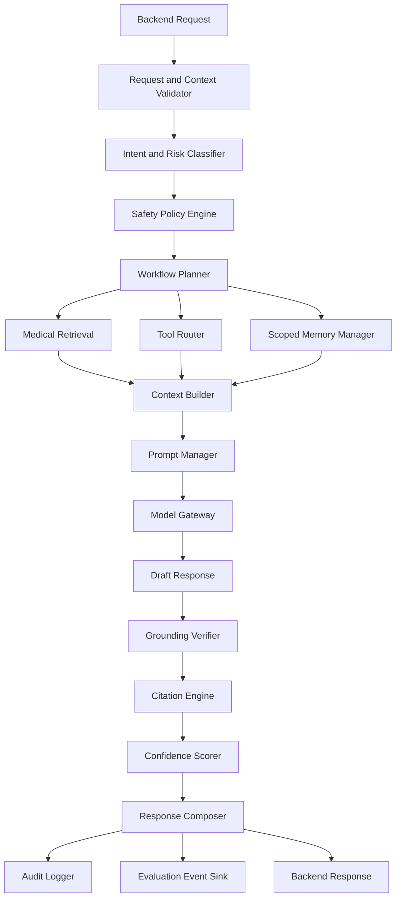
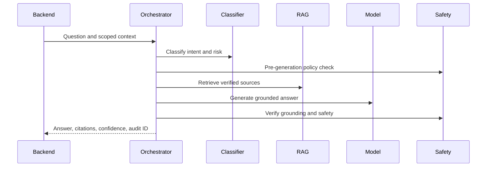

# Zam AI Architecture

## 1. Purpose

This document defines the AI architecture for Zam AI: the internal components
that transform an authorized backend request into a safe, grounded, auditable
medical AI response.

Zam AI must not behave like a direct wrapper around an LLM. It must behave like
a controlled medical intelligence system with retrieval, tools, safety policy,
citations, confidence scoring, evaluation, and conservative failure behavior.

The main backend owns user authentication, authorization, and application data.
Zam AI receives scoped context from the backend and uses that context only for
the requested AI workflow.

## 2. Core AI Principle

No medical response should ever come from an LLM's internal knowledge.

The LLM may synthesize, explain, format, translate, or reason over supplied
evidence. It must not invent clinical facts, citations, contraindications,
interaction data, dosage guidance, or patient-specific medical recommendations.

Every medical output must be grounded in:

- Retrieved verified medical sources.
- Approved structured medical data.
- Deterministic clinical tools.
- Authorized patient or workflow context supplied by the backend.

If adequate grounding is unavailable, the system must refuse, ask for
clarification, or escalate.

## 3. AI System Overview

## 4. Component Responsibilities

### 4.1 Request and Context Validator

Responsibilities:

- Validate internal request schema.
- Verify required workflow fields.
- Confirm request IDs and trace IDs.
- Validate context supplied by the backend.
- Reject malformed patient, prescription, medication, or pharmacy context.
- Enforce maximum request size.
- Detect missing consent flags where patient context is used.

The validator should not decide clinical safety. It ensures the workflow has
well-formed inputs before the orchestrator begins.

### 4.2 Conversation Orchestrator

The conversation orchestrator coordinates all AI steps for conversational
workflows.

Responsibilities:

- Maintain workflow state.
- Decide which classifiers, retrieval calls, tools, and prompts are needed.
- Enforce that medical generation cannot run without evidence.
- Handle streaming response coordination.
- Create final structured outputs.
- Emit audit and evaluation events.

The orchestrator should be deterministic where possible. LLM calls should be
used for language understanding and generation, not for hidden control flow that
cannot be audited.

### 4.3 Intent Classifier

The intent classifier identifies the user's goal.

Common intents:

- General medical question.
- Symptom guidance.
- Emergency symptoms.
- Drug information.
- Drug interaction check.
- Contraindication check.
- Dosage verification.
- Prescription OCR.
- Prescription explanation.
- Reminder schedule parsing.
- Patient education.
- Doctor assistant.
- Pharmacy assistant.
- Non-medical request.
- Prompt injection or unsafe request.

Classifier output should include:

- Primary intent.
- Secondary intents.
- Confidence.
- Required context.
- Recommended workflow.
- Whether retrieval is required.
- Whether tools are required.

### 4.4 Risk Classifier

The risk classifier determines clinical and safety sensitivity.

Risk levels:

- `low`: educational, non-personalized, low-risk.
- `medium`: medical guidance with possible patient impact.
- `high`: dosage, contraindication, interaction, pregnancy, pediatric, chronic
  disease, or clinician-facing decision support.
- `emergency`: urgent symptoms, severe adverse reactions, self-harm, poisoning,
  or other immediate danger.

High-risk and emergency workflows require stricter evidence, more conservative
language, and stronger refusal thresholds.

### 4.5 Safety Policy Engine

The safety policy engine enforces medical and product constraints.

Pre-generation checks:

- Is this a medical request?
- Is retrieval required?
- Is required patient context present?
- Is the user asking for unsafe instructions?
- Is emergency escalation required?
- Is the requested workflow allowed for the caller role?

Post-generation checks:

- Are medical claims grounded?
- Are citations valid?
- Did the model introduce unsupported facts?
- Did the model overstate certainty?
- Did the model provide diagnosis or prescription beyond scope?
- Does the response include appropriate escalation language?

### 4.6 Tool Router

The tool router selects deterministic tools.

Initial tools:

- Medication name normalizer.
- Brand-to-generic resolver.
- Drug interaction checker.
- Contraindication checker.
- Dosage reference checker.
- Prescription OCR.
- Prescription parser.
- Reminder schedule parser.
- Language detector.
- Translation tool.

Tool outputs must be structured and auditable.

### 4.7 Context Builder

The context builder assembles the evidence packet supplied to the model.

Inputs:

- Retrieved source chunks.
- Tool outputs.
- Authorized patient context.
- Conversation history window.
- Product workflow metadata.
- Safety policy instructions.

Responsibilities:

- Remove irrelevant retrieved chunks.
- Preserve source metadata.
- Keep patient context minimal.
- Separate evidence from instructions.
- Compress context when needed.
- Mark unsupported or missing context.

### 4.8 Prompt Manager

Prompt management must be versioned and auditable.

Each prompt should define:

- Purpose.
- Workflow.
- Version.
- Owner.
- Last review date.
- Safety constraints.
- Output schema.
- Required evidence format.
- Refusal behavior.
- Citation behavior.

Prompt versions must be logged with every AI response.

### 4.9 Model Gateway

The model gateway abstracts LLM providers.

Required capabilities:

- Chat generation.
- Structured output.
- Tool calling where supported.
- Streaming.
- Token usage capture.
- Latency capture.
- Provider fallback.
- Timeout handling.
- Model version tracking.

Business logic must call the model gateway, not provider SDKs directly.

### 4.10 Grounding Verifier

The grounding verifier checks whether the draft response is supported by the
evidence packet.

Checks:

- Every medical claim is supported.
- Citations correspond to relevant sources.
- The response does not add unsupported contraindications or interactions.
- The response does not imply diagnosis without evidence.
- The response does not hide missing context.

When grounding fails, the system should either revise using stricter evidence or
refuse.

### 4.11 Citation Engine

The citation engine links response claims to source chunks.

Responsibilities:

- Select cited sources.
- Deduplicate citations.
- Preserve source version metadata.
- Return citation IDs to the backend.
- Support user-facing and audit-only citation formats.

### 4.12 Confidence Scorer

Confidence should reflect evidence quality, not model confidence alone.

Signals:

- Retrieval relevance.
- Source authority.
- Source freshness.
- Agreement across sources.
- Tool confidence.
- OCR confidence.
- Context completeness.
- Grounding score.
- Risk level.

High-risk workflows should require higher confidence before producing guidance.

### 4.13 Response Composer

The response composer creates the final structured payload.

Payload should include:

- User-facing response text or structured result.
- Citations.
- Safety metadata.
- Confidence metadata.
- Refusal or escalation action.
- Missing context.
- Tool results where appropriate.
- Audit trace ID.

The backend decides how to render the final product experience.

## 5. Workflow Patterns

### 5.1 Medical Q&A

### 5.2 Emergency Symptom Workflow

Emergency workflows should prioritize escalation over detailed generation.

Behavior:

- Detect emergency signals.
- Avoid long diagnostic reasoning.
- Provide urgent care instruction.
- Encourage contacting local emergency services or immediate medical care.
- Log the event as high-risk.

### 5.3 Drug Interaction Workflow

The interaction workflow should use structured tools before LLM generation.

Flow:

- Normalize medications.
- Resolve active ingredients.
- Run interaction tool.
- Retrieve supporting interaction references.
- Generate explanation.
- Verify that severity and recommendation match tool output.

### 5.4 Prescription OCR Workflow

Prescription OCR should be asynchronous when image processing may be slow.

Flow:

- Backend sends image reference.
- AI service creates OCR job.
- Worker extracts text and fields.
- Parser normalizes medication names and dosage fields.
- Low-confidence fields are flagged.
- Backend receives structured extraction and review status.
- Explanation workflow can run only after extraction confidence is acceptable.

## 6. Memory Architecture

Memory must be scoped and privacy-conscious.

Allowed memory sources:

- Conversation history supplied by backend.
- Authorized patient profile fields supplied by backend.
- AI-owned workflow traces used for evaluation and safety.

Disallowed by default:

- Unbounded long-term memory inside the AI service.
- Silent patient profile construction.
- Use of old conversation data without backend authorization.

Memory rules:

- Keep context windows minimal.
- Use summaries only when generated and stored under approved policy.
- Record which memory/context fields affected the answer.
- Do not use conversation history as medical evidence unless it represents
  user-supplied context, not clinical truth.

## 7. Language Detection and Translation

Zam AI should eventually support multilingual interaction. Translation must not
weaken medical safety.

Requirements:

- Detect language before response.
- Retrieve from canonical medical sources when possible.
- Translate evidence-grounded answers, not unsupported medical knowledge.
- Preserve drug names and dosages exactly.
- Avoid translating medication names in ways that alter meaning.
- Log language and translation model versions.

## 8. Personalization

Personalization is allowed only when the backend supplies authorized context.

Personalization inputs may include:

- Age.
- Sex where clinically relevant.
- Pregnancy or breastfeeding status.
- Allergies.
- Current medications.
- Known conditions.
- Prescription details.

The system should explicitly state when personalization is limited by missing
context. It should not imply that a medication is safe for a patient when key
information is absent.

## 9. Doctor Assistant

Doctor-facing workflows can provide more technical detail but must still be
grounded.

Capabilities:

- Patient context summary.
- Medication risk review.
- Interaction analysis.
- Contraindication review.
- Patient education draft generation.
- Evidence-linked clinical notes.

Doctor outputs should distinguish:

- Source-backed facts.
- Patient-supplied context.
- AI synthesis.
- Uncertainty.
- Suggested clinician review points.

## 10. Pharmacy Assistant

Pharmacy workflows should combine medication knowledge with pharmacy context
supplied by the backend.

Capabilities:

- Medication explanation.
- Interaction warnings.
- Contraindication warnings.
- Alternative medication support.
- Inventory-aware suggestions.

Inventory availability must never be treated as clinical equivalence. The system
must state when pharmacist review is required.

## 11. Voice Architecture

Voice should be treated as a future interface layer, not a separate medical
reasoning system.

Future components:

- Speech-to-text.
- Text normalization.
- Medical entity preservation.
- AI orchestration.
- Text-to-speech.
- Voice audit metadata.

Voice-specific risks:

- Misheard drug names.
- Misheard dosages.
- Noisy environments.
- User urgency or distress.

Voice workflows should require confirmation for medication names, dosage, and
high-risk medical facts.

## 12. Future Predictive AI

Predictive analytics should be separated from conversational generation.

Possible future capabilities:

- Medication adherence risk.
- Pharmacy demand forecasting.
- Outbreak signal detection.
- Patient risk scoring.
- Drug shortage prediction.

Requirements:

- Separate model governance.
- Separate training and validation datasets.
- Bias and fairness evaluation.
- Clinical validation.
- Explainability.
- Human review.

Predictive outputs should not silently feed into patient-facing advice without
explicit product and clinical approval.

## 13. Audit Requirements

Every medical AI response should log:

- Request ID.
- Workflow.
- Caller service.
- User role.
- Context fields used.
- Intent and risk classification.
- Retrieval query.
- Source IDs and versions.
- Tool calls and results.
- Prompt version.
- Model provider and version.
- Safety checks.
- Grounding score.
- Confidence score.
- Final action.

## 14. Evaluation Hooks

The AI architecture must emit events for:

- Groundedness evaluation.
- Citation accuracy.
- Retrieval relevance.
- Medical correctness review.
- Prompt regression testing.
- Safety refusal analysis.
- Emergency escalation recall.
- Latency and cost tracking.

Evaluation details are defined in `docs/08_AI_EVALUATION.md`.

## 15. Failure Behavior

The system should fail safely.

Failure rules:

- If retrieval fails, do not generate medical advice.
- If citations cannot be validated, refuse or revise.
- If tool output conflicts with model draft, trust the tool or escalate.
- If patient context is missing, avoid personalized guidance.
- If OCR confidence is low, request review or re-upload.
- If emergency risk is detected, escalate immediately.

## 16. Open Questions

- Which LLM provider should be the MVP default?
- Which workflows require streaming?
- What exact clinical safety policy will be approved for symptom guidance?
- Which patient context fields will the backend supply in MVP?
- Which workflows require clinician or pharmacist review before user display?
- How should citations be rendered in each product surface?

## 17. Change Log

| Date | Change | Status |
| --- | --- | --- |
| 2026-06-29 | Initial AI architecture created. | Draft |
