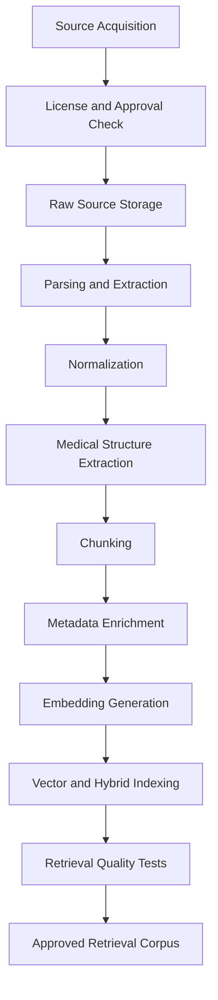

# Zam AI RAG Architecture

## 1. Purpose

This document defines the Retrieval-Augmented Generation architecture for Zam
AI's medical intelligence platform.

RAG is the primary safety mechanism that prevents the system from answering
medical questions from an LLM's internal knowledge. The RAG platform must ingest
verified medical sources, preserve provenance, retrieve relevant evidence, build
safe context packets, support citation generation, and enable grounding
verification.

## 2. Core RAG Rule

No medical answer may be generated unless the system has retrieved or received
reliable evidence for the requested medical claim.

If retrieval fails, returns low-quality evidence, returns conflicting evidence,
or cannot support the requested specificity, the AI system must refuse, ask for
clarification, or escalate.

## 3. Medical Source Strategy

Planned sources include:

- NAFDAC.
- EMDEX.
- BNF.
- MIMS.
- WHO ATC.
- Nigeria Essential Medicines List.
- Internal pharmacy inventory.
- Prescription history supplied by backend.
- Patient health records supplied by backend.

These sources are not equal. The system must distinguish canonical medical
references from local operational data and patient-specific data.

## 4. Source Categories

### 4.1 Canonical Medical References

Examples:

- BNF.
- MIMS.
- EMDEX.
- WHO ATC.

Use:

- Drug information.
- Contraindications.
- Warnings.
- Side effects.
- Dosage references where licensed and available.

Requirements:

- Track license.
- Track version.
- Track publication date.
- Preserve original text.
- Preserve normalized text.

Trust tier ranking (for conflict resolution only, not for filtering retrieval):
1. EMDEX (Nigeria-specific, NAFDAC-aligned, primary clinical reference)
2. WHO ATC / WHO EML (global regulatory-grade)
3. NAFDAC Greenbook (registration status, not clinical dosing authority)
4. BNF / MIMS (supplementary, UK/global context)

### 4.2 Regulatory and Market Sources

Examples:

- NAFDAC.
- Nigeria Essential Medicines List.

Use:

- Local drug registration.
- Essential medicine availability.
- Country-specific medication metadata.

Requirements:

- Track jurisdiction.
- Track registration status.
- Track source freshness.

### 4.3 Operational Data

Examples:

- Internal pharmacy inventory.
- Pharmacy price and availability.

Use:

- Inventory-aware pharmacy workflows.
- Availability and substitution support.

Important constraint:

Operational availability is not clinical evidence. The system must not treat
stock availability as proof of medical appropriateness.

### 4.4 Patient-Specific Context

Examples:

- Prescription history.
- Patient health records.
- Allergies.
- Current medications.

Use:

- Personalization.
- Contraindication checks.
- Interaction checks.
- Doctor assistant workflows.

Important constraint:

Patient context should be supplied by the main backend after authorization. It
should not be treated as canonical medical knowledge.

## 5. RAG Pipeline Overview

No source should enter the active retrieval corpus until it passes license,
quality, parsing, metadata, and retrieval checks.

## 6. Document Ingestion

Ingestion responsibilities:

- Acquire source documents.
- Validate source license and permission.
- Store original files.
- Extract text and tables.
- Normalize layout artifacts.
- Preserve page, section, and document references.
- Detect parsing errors.
- Generate checksums.
- Assign source versions.

Supported formats may include:

- PDF.
- HTML.
- DOCX.
- CSV.
- JSON.
- XML.
- Database exports.

Each ingestion run should produce an immutable source version.

## 7. Normalization

Normalization converts raw extracted text into consistent medical text.

Tasks:

- Remove headers and footers when safe.
- Preserve section headings.
- Normalize whitespace.
- Preserve medication names.
- Preserve dosages and units exactly.
- Preserve tables with structure.
- Normalize encoding.
- Detect language.
- Extract references to ingredients, brands, routes, strengths, and forms.

Do not normalize in a way that changes clinical meaning. For example, dosage
units must not be casually converted without explicit unit validation.

## 8. Medical Structure Extraction

Structured extraction should identify:

- Drug generic name.
- Brand names.
- Active ingredients.
- Strength.
- Route.
- Form.
- Indications.
- Contraindications.
- Warnings.
- Interactions.
- Side effects.
- Dosage sections.
- Pregnancy and breastfeeding guidance.
- Pediatric guidance.
- Geriatric guidance.
- Renal or hepatic impairment guidance.
- Source section.

Structured extraction supports filtering, retrieval, and deterministic tools.
Because extraction can fail, extracted fields should include confidence and
source references.

## 9. Chunking Strategy

Chunking is a medical safety decision, not only a search optimization.

Bad chunking can separate a warning from the drug it applies to, separate dosage
from population constraints, or remove source context needed for citation.

Recommended chunking approach:

- Use semantic section-aware chunking.
- Keep drug identity attached to every chunk.
- Keep source, section, and page metadata.
- Keep indication, contraindication, dosage, and warning sections separate where
  possible.
- Use overlap only when it preserves context.
- Avoid giant chunks that bury important details.
- Avoid tiny chunks that lose clinical meaning.

Chunk types:

- Drug overview.
- Indication.
- Contraindication.
- Interaction.
- Warning.
- Dosage.
- Administration.
- Side effect.
- Pregnancy and breastfeeding.
- Pediatric use.
- Regulatory status.

## 10. Metadata Schema

Every chunk should include metadata.

Required metadata:

- `source_id`
- `source_name`
- `source_type`
- `source_version`
- `publisher`
- `license_status`
- `jurisdiction`
- `document_id`
- `document_title`
- `document_version`
- `section_path`
- `page_number`
- `chunk_id`
- `chunk_type`
- `language`
- `created_at`
- `checksum`

Medication metadata where applicable:

- `generic_name`
- `brand_names`
- `active_ingredients`
- `atc_code`
- `strength`
- `route`
- `form`
- `population`
- `condition`
- `severity`
- `drug_entity_id`   # canonical ID resolved at ingestion time, shared across all sources
- `source_trust_tier`

Operational metadata where applicable:

- `pharmacy_id`
- `inventory_timestamp`
- `availability_status`
- `price_band`

Patient-specific context should not be stored in the canonical vector corpus.

## 11. Embeddings

Embeddings convert chunks and queries into vectors for semantic retrieval.

Selection criteria:

- Medical retrieval quality.
- Support for English and future local languages.
- Stable model versioning.
- Cost.
- Latency.
- Batch throughput.
- Data privacy terms.
- Provider reliability.
- Ability to run offline or self-host if needed.

Candidate approaches:

- Commercial embedding API.
- Open-source embedding model hosted by Zamda Health.
- Cloud provider embedding model.

Recommendation:

Start with a strong managed embedding provider for speed and quality during MVP,
but keep the embedding interface provider-neutral. Store embedding model name,
version, dimensionality, and generation timestamp with every vector. Re-embedding
must be treated as a versioned corpus migration.

The final provider should be selected after benchmark testing on Zam AI's own
medical retrieval dataset.

## 12. Vector Database

Vector database options:

- Postgres with `pgvector`.
- Qdrant.
- Weaviate.
- Pinecone.
- Vertex AI Vector Search.

Selection criteria:

- Metadata filtering.
- Hybrid search support.
- Latency.
- Scale.
- Operational complexity.
- Cost.
- Backup and restore.
- Local development support.
- Cloud deployment fit.
- Team familiarity.

Initial recommendation:

Use `pgvector` only if corpus size, query load, and filtering requirements remain
modest during MVP and the backend team is comfortable operating Postgres-backed
vector search. Use Qdrant or a managed vector database if the retrieval layer
needs stronger metadata filtering, isolation from transactional workloads,
larger scale, or easier vector operations.

Do not choose based on trendiness. Choose based on measured retrieval quality,
filtering needs, cost, and operations.

## 13. Hybrid Retrieval

Medical retrieval should use hybrid retrieval rather than vector search alone.

Why:

- Drug names require exact matching.
- Brand names and generic names must resolve precisely.
- Dosage units and strengths are symbolic.
- Rare terms may be missed by semantic search.
- User misspellings need fuzzy matching.

Hybrid retrieval should combine:

- Keyword search.
- Vector search.
- Metadata filters.
- Medication normalization.
- Brand-to-generic mapping.
- Query rewriting.
- Reranking.

## 14. Query Processing

Before retrieval, the system should process the query.

Steps:

- Detect language.
- Identify medical entities.
- Normalize medication names.
- Resolve brand names to ingredients where possible.
- Identify patient-specific constraints.
- Identify risk category.
- Decide source filters.
- Rewrite the query into retrieval queries.

Example:

User asks: "Can I take Augmentin with warfarin?"

Retrieval plan:

- Resolve Augmentin to amoxicillin/clavulanate.
- Resolve warfarin.
- Retrieve interaction references.
- Retrieve warnings for both drugs.
- Use interaction tool if available.
- Require high-confidence source match.

## 15. Reranking

Reranking improves relevance after first-pass retrieval.

Reranker requirements:

- Understand medical terminology.
- Prefer exact medication matches.
- Prefer current approved sources.
- Prefer correct jurisdiction when relevant.
- Penalize chunks with ambiguous drug identity.
- Preserve diversity across source types when useful.

Reranking output should include relevance score and rationale metadata where
possible.

## 16. Context Construction

## 16a. 
Before context construction, chunks retrieved for the same drug_entity_id 
across multiple sources are compared for the specific fact type being queried 
(dosage, contraindication, interaction, etc.).

- Agreement across sources → proceed, cite primary tier, note corroboration.
- Disagreement → do not let generation silently pick one. Either surface 
  both with a conflict flag, or default to highest trust tier and log the 
  conflict for review.
- Single-source coverage → proceed with lower confidence score, may trigger 
  stricter refusal threshold for high-risk categories.

## 16b.
The RAG context packet should include:

- Retrieved chunks.
- Source metadata.
- Citation handles.
- Tool outputs.
- Missing evidence indicators.
- Conflicting evidence indicators.
- Risk level.
- Instructions for citation behavior.

Context rules:

- Keep instructions separate from evidence.
- Mark retrieved text as untrusted evidence, not instructions.
- Do not include irrelevant chunks just to fill context.
- Include source versions.
- Prefer concise evidence over large context dumps.

## 17. Citation Generation

Citations must be traceable to source chunks.

Citation metadata:

- Citation ID.
- Source name.
- Source version.
- Document title.
- Section.
- Page number if available.
- Chunk ID.
- URL or storage reference where allowed.
- Access date or ingestion date.

Citation requirements:

- Every medical claim should be supportable by citations.
- Citations should not point to irrelevant chunks.
- Citations should be stable across audits.
- User-facing citation formatting may differ from internal metadata.

## 18. Grounding Verification

Grounding verification checks whether the generated response is supported by the
retrieved evidence.

Checks:

- Claim support.
- Citation relevance.
- No unsupported dosage claims.
- No unsupported interaction claims.
- No unsupported contraindication claims.
- No unsupported diagnosis.
- No hidden contradiction.

If grounding fails:

- Regenerate with stricter instruction if safe.
- Remove unsupported content.
- Ask for clarification.
- Refuse.
- Escalate for high-risk cases.

## 19. Hallucination Prevention

Hallucination prevention mechanisms:

- Retrieval-required policy.
- Source allowlist.
- Source versioning.
- Structured tools for interactions and dosage.
- Strict prompt templates.
- Evidence-only generation.
- Post-generation grounding verification.
- Citation validation.
- Refusal thresholds.
- Evaluation tests.
- Production monitoring.

The strongest protection is architectural: the model should never be asked to
answer a medical question without evidence.

## 20. Prompt Construction

Medical prompts should include:

- Role and task.
- Safety policy.
- User question.
- Authorized context.
- Retrieved evidence.
- Tool outputs.
- Output schema.
- Citation instructions.
- Refusal instructions.

Prompts should not include:

- Unbounded conversation history.
- Unverified medical claims.
- Raw retrieved text mixed with system instructions.
- Secrets.
- Unnecessary patient identifiers.

## 21. Context Compression

Context compression may be required for long documents or many retrieved chunks.

Compression rules:

- Preserve clinical meaning.
- Preserve medication identity.
- Preserve warnings and contraindications.
- Preserve dosage constraints.
- Preserve source metadata.
- Do not summarize low-confidence OCR as fact.

Compressed evidence should be marked as derived and traceable to original chunks.

## 22. Update Pipeline

Medical knowledge changes. The RAG corpus must support updates.

Update flow:

- Acquire new source version.
- Ingest and parse.
- Run normalization checks.
- Chunk and embed.
- Run retrieval regression tests.
- Compare source changes.
- Stage corpus.
- Approve corpus.
- Promote to active retrieval.
- Preserve previous version for audit.

## 23. Evaluation

RAG evaluation should measure:

- Retrieval recall.
- Top-k relevance.
- Medication exact-match accuracy.
- Brand-to-generic resolution accuracy.
- Citation accuracy.
- Source freshness.
- Chunk quality.
- Groundedness.
- Answer faithfulness.
- Latency.

Evaluation datasets should include:

- Common drug questions.
- Local brand names.
- Misspellings.
- Interaction questions.
- Contraindication questions.
- Pediatric and pregnancy cases.
- Emergency symptom cases.
- OCR-derived prescription queries.
- Prompt injection attempts.

## 24. Medical Source Versioning

Every answer must be auditable against source versions.

Versioning requirements:

- Immutable source versions.
- Immutable chunk versions.
- Embedding model version.
- Parser version.
- Chunker version.
- Retrieval configuration version.
- Active corpus version.

Audit logs should be able to reconstruct which evidence was available at answer
time.

## 25. Security and Privacy

RAG-specific security requirements:

- Only approved sources enter canonical corpus.
- Retrieved document text is treated as untrusted content.
- Prompt injection in documents must be detected.
- Patient-specific context is not indexed into canonical knowledge corpus.
- Sensitive prescription images and OCR artifacts follow retention policy.
- Access to source documents and chunks is controlled.

## 26. Operational Monitoring

Monitor:

- Ingestion success rate.
- Parser error rate.
- Empty retrieval rate.
- Low-confidence retrieval rate.
- Reranker latency.
- Vector database latency.
- Citation validation failures.
- Grounding failures.
- Corpus freshness.
- Source update failures.

Alerts:

- Retrieval outage.
- Vector store unavailable.
- Sudden spike in empty results.
- Source ingestion failure.
- Grounding failure spike.
- Active corpus promotion failure.

## 27. Open Questions

- Which sources are licensed for MVP?
- What formats will each source provide?
- Which embedding models should be benchmarked?
- Which vector database will be selected?
- Is hybrid search implemented inside the vector store or across separate search
  systems?
- Who approves new source versions?
- What citation format should be shown to patients?
- What citation detail should be shown to doctors?
- What source freshness thresholds are required?
- What is the trust tier ranking when canonical sources disagree?
- Who resolves logged cross-source conflicts — clinical reviewer, or 
  automatic default-to-tier?
- What disagreement threshold triggers a flag (e.g. dosage differs by X%) 
  vs. silent default to primary source?

## 28. Acceptance Criteria

The RAG platform is ready for MVP when:

- At least one approved medical source is ingested and versioned.
- Chunks preserve source and medication metadata.
- Retrieval supports exact drug matching and semantic search.
- Citations map to source chunks.
- Medical answers refuse when retrieval is weak or missing.
- Grounding verification blocks unsupported claims.
- RAG evaluation datasets exist.
- Corpus updates preserve previous versions.
- Audit logs record source versions and chunk IDs.

## 29. Change Log

| Date | Change | Status |
| --- | --- | --- |
| 2026-06-29 | Initial RAG architecture created. | Draft |
