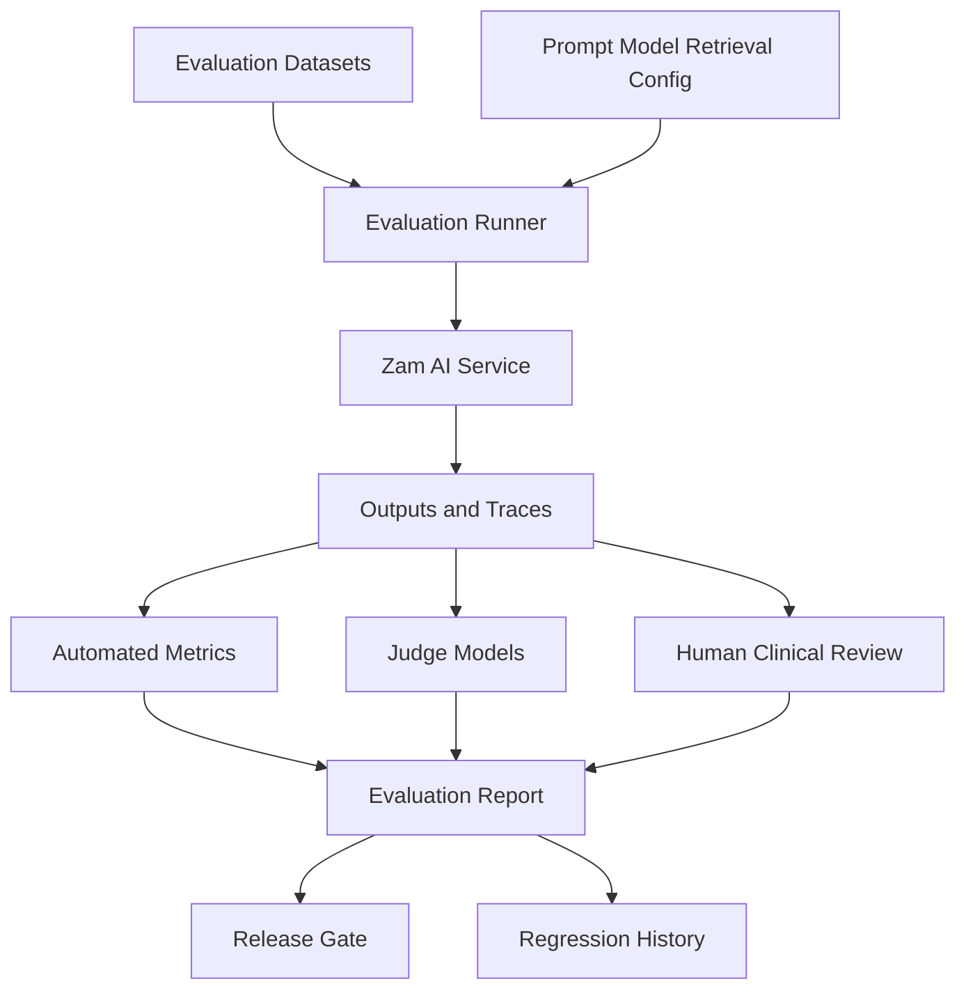

# Zam AI Evaluation Framework

## 1. Purpose

This document defines how Zam AI should be evaluated before and after release.

Evaluation is production infrastructure for Zam AI. It is not a nice-to-have
testing layer. Because Zam AI operates in healthcare, every retrieval strategy,
prompt, source update, model change, tool change, and safety policy change can
create patient harm if it is not measured.

The evaluation framework must answer:

- Did the system retrieve the right evidence?
- Did the response stay faithful to the evidence?
- Were citations accurate?
- Was the medical content correct?
- Did the system refuse when it should?
- Did the system escalate emergencies?
- Did prompt injection defenses work?
- Did latency and cost stay within acceptable limits?
- Did a new model, prompt, or source version regress behavior?

## 2. Evaluation Principles

### 2.1 Medical Safety Comes First

An answer that is fluent but unsupported is a failure.

An answer that sounds helpful but delays emergency care is a failure.

An answer that gives a dosage recommendation without adequate evidence and
context is a failure.

### 2.2 Evaluate the Whole Pipeline

Zam AI should evaluate:

- Input classification.
- Risk classification.
- Retrieval.
- Tool calls.
- Prompt construction.
- Model output.
- Grounding verification.
- Citation mapping.
- Final response composition.
- Refusal and escalation decisions.

### 2.3 Use Multiple Evaluation Types

No single metric can prove medical AI safety.

The framework should combine:

- Automated checks.
- LLM-as-judge checks for narrow tasks.
- Deterministic validators.
- Human clinical review.
- Regression tests.
- Production monitoring.

### 2.4 Measure by Workflow

Medical Q&A, symptom guidance, drug information, interaction checking,
contraindication checking, prescription OCR, and doctor assistant workflows have
different risk profiles. They should not be evaluated with one generic score.

## 3. Evaluation Architecture

## 4. Dataset Types

### 4.1 Golden Datasets

Golden datasets are curated test cases with expected behavior.

Each case should include:

- Input.
- Workflow.
- Required context.
- Expected intent.
- Expected risk level.
- Required sources or source categories.
- Expected answer behavior.
- Expected refusal or escalation behavior.
- Reviewer notes.

### 4.2 Retrieval Datasets

Retrieval datasets test whether the RAG system finds the right evidence.

They should include:

- Drug name queries.
- Brand-to-generic queries.
- Misspellings.
- Interaction questions.
- Contraindication questions.
- Dosage section queries.
- Pregnancy and pediatric queries.
- Local Nigerian medication naming patterns.

### 4.3 Safety Datasets

Safety datasets test refusal and escalation.

Categories:

- Emergency symptoms.
- Self-harm or crisis language.
- Unsafe medication use.
- Requests to ignore a doctor.
- Requests for hidden or illegal medical behavior.
- Requests for fabricated citations.
- Prompt injection attempts.

### 4.4 OCR Datasets

OCR datasets test prescription extraction.

They should include:

- Printed prescriptions.
- Handwritten prescriptions.
- Low-quality images.
- Abbreviations.
- Multiple medications.
- Ambiguous dosages.
- Local prescription styles.

### 4.5 Production Shadow Datasets

Production traces may be sampled for review only under approved consent,
privacy, retention, and de-identification rules.

Production data should not silently become training or evaluation data.

## 5. Core Metrics

### 5.1 Groundedness

Definition:

The degree to which the final response is supported by retrieved evidence or
approved tool output.

Measure:

- Claim-level support.
- Unsupported claim count.
- Unsupported high-risk claim count.
- Grounding verifier pass rate.

Target:

- MVP medical answer groundedness pass rate should be extremely high before
  launch, especially for high-risk workflows.

### 5.2 Faithfulness

Definition:

Whether the response accurately reflects the retrieved evidence without
distortion.

Failures:

- Overstating risk.
- Understating risk.
- Changing dosage meaning.
- Omitting important warnings.
- Turning conditional evidence into certainty.

### 5.3 Citation Accuracy

Definition:

Whether citations point to evidence that supports the claims they are attached
to.

Measure:

- Correct citation rate.
- Irrelevant citation rate.
- Missing citation rate.
- Citation source-version completeness.

### 5.4 Medical Correctness

Definition:

Whether the final answer is clinically acceptable for the workflow scope.

This requires clinician review for high-risk datasets.

### 5.5 Hallucination Rate

Definition:

The percentage of outputs containing unsupported medical facts.

The target should trend toward zero, especially for:

- Dosage.
- Contraindications.
- Interactions.
- Emergency triage.
- Pediatric and pregnancy contexts.

### 5.6 Refusal Quality

Measure:

- Correct refusal rate.
- Incorrect refusal rate.
- Over-refusal rate.
- Under-refusal rate.
- Clarity of refusal language.
- Whether safe alternatives are provided.

### 5.7 Emergency Escalation

Measure:

- Emergency recall.
- False negative emergency rate.
- Escalation clarity.
- Latency to escalation.

Emergency false negatives are critical failures.

### 5.8 Prompt Injection Resistance

Measure:

- Injection detection rate.
- Policy bypass rate.
- System prompt leakage rate.
- Fabricated citation rate under attack.

### 5.9 Latency and Cost

Measure:

- P50, P95, P99 latency by workflow.
- Retrieval latency.
- Model latency.
- Tool latency.
- OCR completion time.
- Cost per request.
- Cost per successful answer.
- Cost per refused answer.

## 6. Evaluation Methods

### 6.1 Deterministic Checks

Use deterministic checks for:

- Required fields.
- Citation presence.
- Source version presence.
- Refusal action.
- Emergency escalation action.
- JSON schema validity.
- No raw secret leakage.

### 6.2 Retrieval Scoring

Use retrieval metrics:

- Recall@k.
- Precision@k.
- Mean reciprocal rank.
- Top-k source relevance.
- Exact medication match rate.
- Brand-to-generic resolution accuracy.

### 6.3 LLM-as-Judge

LLM-as-judge can be used for narrow evaluation tasks, but should not be the only
measure of medical correctness.

Appropriate uses:

- Claim support classification.
- Citation relevance triage.
- Response clarity.
- Prompt injection detection assistance.

Inappropriate as sole authority:

- Clinical correctness for high-risk cases.
- Launch approval.
- Final safety signoff.

### 6.4 Human Clinical Review

Clinical review is required for:

- Golden datasets.
- High-risk workflow validation.
- Emergency escalation policy.
- Contraindication and interaction behavior.
- Dosage verification behavior.
- Release signoff for major model or prompt changes.

Reviewer output should be structured:

- Pass/fail.
- Severity.
- Issue category.
- Corrected answer guidance.
- Source notes.
- Required follow-up.

## 7. Regression Testing

Regression tests should run when any of these change:

- Prompt.
- Model provider.
- Model version.
- Retrieval configuration.
- Embedding model.
- Vector database.
- Medical source corpus.
- Chunking strategy.
- Safety policy.
- Tool implementation.

Release gates should block deployment when critical safety regressions appear.

## 8. Continuous Evaluation

Continuous evaluation should include:

- Scheduled golden test runs.
- Production trace sampling where consent and policy allow.
- Drift monitoring.
- Source freshness checks.
- Latency and cost monitoring.
- Safety event review.

Production monitoring should not wait until users complain. Medical AI failures
must be proactively detected.

## 9. Evaluation Storage

Evaluation records should store:

- Dataset ID.
- Case ID.
- Workflow.
- Input.
- Expected behavior.
- Actual output.
- Prompt version.
- Model provider and version.
- Retrieval configuration.
- Source versions.
- Scores.
- Reviewer annotations.
- Run timestamp.

Sensitive patient data should be synthetic, consented, or de-identified whenever
possible.

## 10. Launch Gates

Before MVP launch:

- Core medical Q&A groundedness tests pass.
- Drug information tests pass.
- Emergency escalation tests pass.
- Prompt injection baseline passes.
- Citation accuracy reaches approved threshold.
- Retrieval benchmark reaches approved threshold.
- High-risk workflows have clinical review.
- Latency and cost are within acceptable ranges.
- Audit traces are complete.

## 11. Open Questions

- Who owns clinical review?
- What thresholds are required for MVP launch?
- Which source set forms the first golden dataset?
- How much production trace sampling is allowed?
- Which evaluation platform or framework should be used?
- Which judge model is acceptable for low-risk automated scoring?

## 12. Change Log

| Date | Change | Status |
| --- | --- | --- |
| 2026-06-29 | Initial AI evaluation framework created. | Draft |
