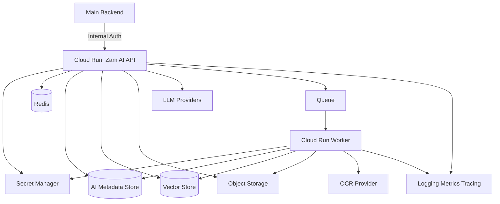
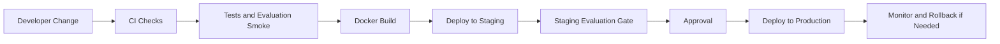

# Zam AI Deployment Architecture

## 1. Purpose

This document defines the deployment architecture for Zam AI.

Zam AI is an internal AI service called by the main Zamda Health backend. The
deployment architecture should provide secure service-to-service access,
reliable AI serving, background processing, observability, secret management,
and safe rollout controls.

## 2. Deployment Goals

The deployment should optimize for:

- Internal-only access.
- Secure backend-to-AI communication.
- Horizontal scalability.
- Reliable background jobs.
- Safe source ingestion.
- Observability.
- Cost control.
- Rollback readiness.
- Environment separation.

## 3. Target Cloud Platform

The expected deployment target is Google Cloud Run.

Why Cloud Run:

- Good fit for containerized FastAPI services.
- Autoscaling.
- Managed HTTPS.
- Revision-based deployments.
- Traffic splitting.
- Simple operational model.
- Works well with background worker patterns and jobs.

Alternatives:

- Kubernetes: more control, more operational burden.
- Compute Engine: simple but less managed.
- Serverless functions: less suitable for complex API and worker runtimes.

Chosen direction:

Use Cloud Run for the AI API and either Cloud Run services, Cloud Run jobs, or a
managed queue worker architecture for background processing.

## 4. High-Level Deployment

## 5. Environments

Required environments:

- Local.
- Development.
- Staging.
- Production.

Environment rules:

- Each environment has separate secrets.
- Production data should not be copied into lower environments without approved
  anonymization.
- Staging should be production-like for retrieval, queues, and observability.
- Production deployments should require passing safety evaluation gates.

## 6. Services

### 6.1 AI API Service

Runtime:

- FastAPI.
- Uvicorn or Gunicorn with Uvicorn workers.
- Containerized with Docker.
- Deployed to Cloud Run.

Responsibilities:

- Internal API endpoints.
- Request validation.
- API-key verification.
- Orchestrator execution.
- Streaming where needed.
- Audit event creation.

### 6.2 Worker Service

Responsibilities:

- Source ingestion.
- Embedding jobs.
- OCR jobs.
- Evaluation runs.
- Batch processing.

Workers should be idempotent and retry-safe.

### 6.3 Scheduled Jobs

Scheduled jobs may handle:

- Source freshness checks.
- Evaluation runs.
- Expired job cleanup.
- Cost report generation.
- Corpus health checks.

## 7. Container Strategy

Docker requirements:

- Small base image.
- Locked dependencies.
- Non-root runtime user where feasible.
- Health check endpoint.
- Environment-based configuration.
- No secrets baked into image.
- Reproducible builds.

Recommended image pattern:

- Build dependencies in builder stage.
- Copy only runtime artifacts.
- Run with minimal permissions.

## 8. Configuration

Configuration should come from environment variables and managed secrets.

Configuration categories:

- Environment name.
- Service version.
- Logging level.
- Internal API key reference.
- Model provider configuration.
- Retrieval configuration.
- Vector store connection.
- Queue connection.
- Object storage bucket.
- Feature flags.

Do not commit production config values.

## 9. Secrets Management

Use managed secret storage for:

- Internal API keys.
- LLM provider keys.
- Embedding provider keys.
- OCR provider keys.
- Database credentials.
- Redis credentials.
- Vector store credentials.
- Monitoring provider keys.

Secrets should be:

- Environment-specific.
- Rotatable.
- Least privilege.
- Access logged.
- Never printed in logs.

## 10. Networking

Production should prefer private access patterns.

Controls:

- Restrict Zam AI to calls from the main backend where possible.
- Use HTTPS/TLS.
- Consider Cloud Run ingress restrictions.
- Consider VPC connectors where needed.
- Consider IP allowlists if private connectivity is not available.
- Do not expose admin endpoints publicly.

## 11. Redis and Queues

Redis may be used for:

- Caching.
- Rate counters.
- Job coordination.
- Lightweight queues.

Queue requirements:

- Retry support.
- Dead-letter handling or equivalent failed-job tracking.
- Visibility into queue depth.
- Idempotency keys.
- Timeout controls.

If Redis-backed queues become operationally fragile, move background job
orchestration to a managed cloud queue.

## 12. AI Metadata Store

Zam AI may need an AI-owned metadata store for:

- Prompt versions.
- Evaluation records.
- Job records.
- Retrieval traces.
- Audit metadata.
- Source metadata.

The main application database remains backend-owned. Any shared database access
must be explicitly approved through architecture review.

## 13. Object Storage

Object storage is used for:

- Source documents.
- Normalized documents.
- Prescription images.
- OCR artifacts.
- Evaluation artifacts.

Requirements:

- Encryption at rest.
- Access controls.
- Signed URLs where necessary.
- Retention policies.
- Version metadata.

## 14. Deployment Flow

## 15. CI/CD Gates

Required checks:

- Formatting.
- Linting.
- Unit tests.
- Integration tests.
- API schema checks.
- Security scans.
- Dependency vulnerability scans.
- Docker build.
- Evaluation smoke tests.

Production gates:

- Safety evaluation pass.
- Emergency escalation tests pass.
- Prompt injection baseline pass.
- No critical dependency vulnerabilities.
- Manual approval for high-risk prompt/model/source changes.

## 16. Rollout Strategy

Cloud Run revisions should support:

- Gradual traffic shifting.
- Immediate rollback.
- Version tagging.
- Separate staging validation.

Feature flags should support:

- Prompt rollout.
- Model rollout.
- Retrieval strategy rollout.
- OCR provider rollout.
- Workflow enablement.

Medical behavior changes should be rolled out carefully and monitored.

## 17. Observability

### 17.1 Logs

Use structured JSON logs with:

- Request ID.
- Trace ID.
- Workflow.
- Endpoint.
- Latency.
- Error code.
- Safety action.
- Model provider.
- Source corpus version.

### 17.2 Metrics

Track:

- Request count.
- Error rate.
- Latency.
- Queue depth.
- Worker failures.
- Retrieval latency.
- Empty retrieval rate.
- Model latency.
- Token usage.
- OCR job time.
- Grounding failures.
- Safety refusals.
- Emergency escalations.
- Cost estimates.

### 17.3 Tracing

Trace:

- Backend request.
- AI API route.
- Retrieval.
- Tool calls.
- Model calls.
- Safety checks.
- Audit writes.

## 18. Autoscaling

API service:

- Scale based on request concurrency.
- Configure max instances to control cost and provider pressure.
- Configure minimum instances if cold start latency is unacceptable.

Workers:

- Scale based on queue depth or job volume.
- Use separate worker pools for expensive OCR/evaluation jobs if needed.

## 19. Disaster Recovery

Requirements:

- Backups for AI metadata store.
- Versioned object storage.
- Exportable prompt and evaluation configs.
- Rebuildable vector indexes from source documents.
- Documented restore procedure.
- Periodic restore tests.

The vector database should be recoverable from source documents and embeddings
or re-embedding pipelines.

## 20. Cost Controls

Cost drivers:

- LLM calls.
- Embeddings.
- OCR.
- Vector database.
- Cloud Run compute.
- Logs and traces.
- Object storage.

Controls:

- Per-workflow budgets.
- Token limits.
- Retrieval limits.
- Caching.
- Batch embedding.
- Rate limits.
- Cost dashboards.
- Provider fallback rules that consider cost and quality.

## 21. Open Questions

- Will production use private networking between backend and AI service?
- Which queue technology is selected for MVP?
- Which vector store is selected?
- Will the AI metadata store be separate from the backend database?
- What are acceptable cold start targets?
- What monitoring stack is preferred?
- What production approval process is required for prompt/model changes?

## 22. Change Log

| Date | Change | Status |
| --- | --- | --- |
| 2026-06-29 | Initial deployment architecture created. | Draft |
